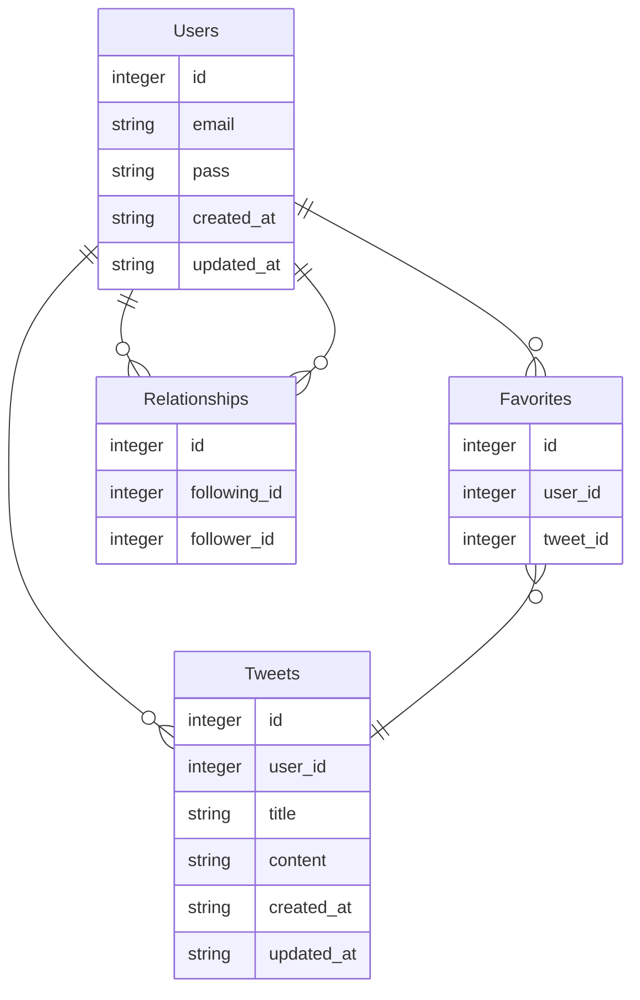

# Hitorigoto

## 概要
Hitorigotoは簡易的なSNSアプリです。

### アプリのURL
- http://hitorigoto-app.com
- ゲストユーザー用のメールアドレスとパスワードでログイン可能です。
  - メールアドレス: `guest_user@example.com`
  - パスワード: `guest_pass`
- アカウントを登録することもできますが、メールアドレスは**架空のもの**を登録するようお願いします。

### 主な機能
- ユーザー登録とログイン
	- ユーザーはアカウントを作成し、ログインすることでアプリを利用できます。
- ひとりごとの投稿
	- ユーザーはひとりごと(140字以内のテキストメッセージ)を入力してを投稿できます。
- ひとりごとの表示
	- ユーザーは投稿されたひとりごとをタイムライン上で閲覧できます。
- ひとりごとのいいね機能
	- ユーザーは他のユーザーが投稿したひとりごとにいいねを付けることができます。
- フォロー/フォロワー機能
	- ユーザーは他のユーザーをフォローすることができます。

### demo動画


## アプリを開発したきっかけ
自身の知識とスキルを向上させるために、実際に使われている技術を使いながら、Webアプリ開発について体系的に学ぶことを目指して、Ruby on Railsを利用して基本的なCRUD機能を持つアプリを開発しました。

## 開発にあたり工夫した点
- 開発環境にDockerを使用して、実際の開発現場で利用される技術を身につける。
- Rubocopを導入してコードの品質を維持し、一貫したコーディングスタイルを確保する。
- RSpecを使用してテストを書くことで、テスト駆動開発を意識して開発する。
- GitHub Actionsを導入してCIを組むことで、開発の効率化とコードの品質を維持する。
- パフォーマンスを意識して、N+1問題の解消に取り組む。

## 使用技術
| カテゴリー | 技術 |
|----------|----------|
| バックエンド  | Ruby 3.2.2, Ruby on Rails 7.0.7.2 |
| フロントエンド  | HTML, CSS,  JavaScript, Bulma |
| データベース  | mysql 8.0.34 |
| インフラ | Docker, Nginx, Unicorn, AWS(EC2, RDS, ALB, Route53) |
| CI/CD  | GitHub Actions |
| その他  | Git, GitHub, RSpec, Rubocop |

## Dockerを使った環境構築
### 環境構築手順
1. リポジトリをクローンする
```
$ git clone https://github.com/ok-os-job-change-team/kaito-twitter-clone-bootcamp.git
```
2. リポジトリに移動する
```
$ cd kaito-twitter-clone-bootcamp
```
3. イメージをビルドする
```
$ docker-compose build
```
4. コンテナを起動する
```
$ docker-compose up -d
```
### ページを表示する
- コンテナを起動後、Webブラウザで`http://localhost:3000/login`にアクセスする。

### その他のコマンド
- コンテナを停止し、作成したコンテナとネットワークを削除する
```
$ docker-compose donw
```

- コンテナ内に入る(実行中のコンテナ内でコマンドを実行する)
```
$ docker exec -it web_app bash
```

## 画面遷移図
Figmaで画面遷移図を作成しました。
[画面遷移図はこちら](https://www.figma.com/file/hd6yLAUfRUJvzbM5cvUcdr/Tubuyaki?type=design&node-id=0-1&mode=design&t=NX5r90lopdH1wt2k-0)

## ER図


## システム構成図
