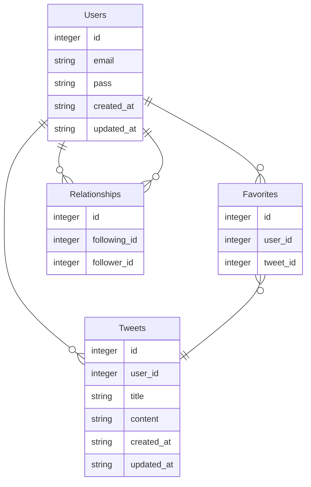

# Hitorigoto

## 概要
- "Hitorigoto"は簡易的なツイッターアプリです。
### ユーザーページ


### 主な機能
- ユーザー登録とログイン
	- ユーザーはアカウントを作成し、ログインすることでアプリを利用できます。
- ひとりごとの投稿
	- ユーザーはひとりごと(140字以内のテキストメッセージ)を入力してを投稿できます。
- ひとりごとの表示
	- ユーザーは投稿されたひとりごとをタイムライン上で閲覧できます。
- ひとりごとのいいね機能
	- ユーザーは他のユーザーが投稿したひとりごとにいいねを付けることができます。
- フォロー/フォロワー機能
	- ユーザーは他のユーザーをフォローすることができます。

## 使用技術
| カテゴリー | 技術 |
|----------|----------|
| バックエンド  | Ruby 3.2.2, Ruby on Rails 7.0.7.2 |
| フロントエンド  | HTML, CSS,  JavaScript, Bulma |
| データベース  | mysql 8.0.34 |
| インフラ(開発環境)  | Docker |
| CI/CD  | GitHub Actions |
| その他  | Git, GitHub, RSpec, Rubocop |

## 環境構築
### コマンド一覧
```bash
# イメージをbuildする
$ docker-compose build

# コンテナを起動する
$ docker-compose up -d

# コンテナを停止し、作成したコンテナとネットワークを削除する
$ docker-compose donw

# コンテナ内に入る(実行中のコンテナ内でコマンドを実行する)
# Reference: https://docs.docker.jp/engine/reference/commandline/compose_exec.html
$ docker exec -it web_app bash
```
### ページを表示する
- コンテナを起動後、Webブラウザで`http://localhost:3000/users/1`にアクセスする。[ログインページはこちら](http://localhost:3000/login)

## 画面遷移図
- figmaで画面遷移図を作成しました。
[画面遷移図はこちら](https://www.figma.com/file/hd6yLAUfRUJvzbM5cvUcdr/Tubuyaki?type=design&node-id=0-1&mode=design&t=NX5r90lopdH1wt2k-0)

## ER図
